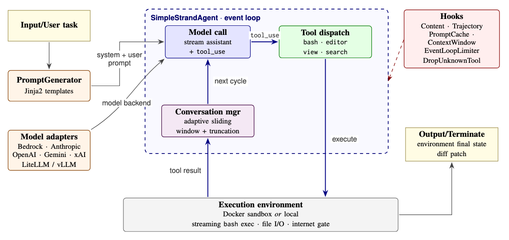
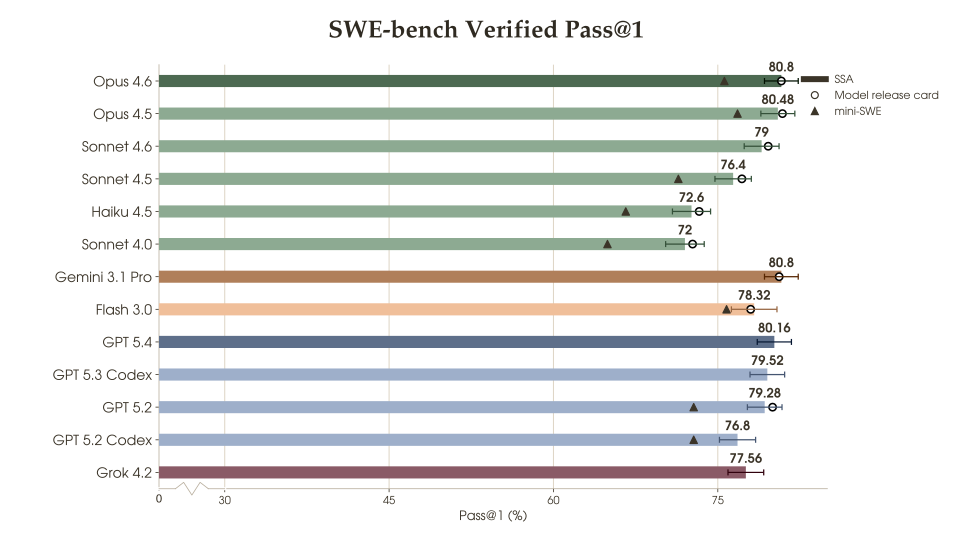
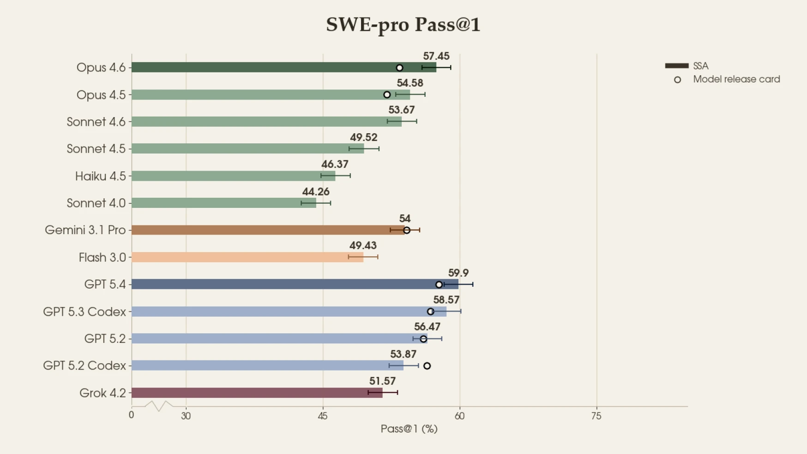
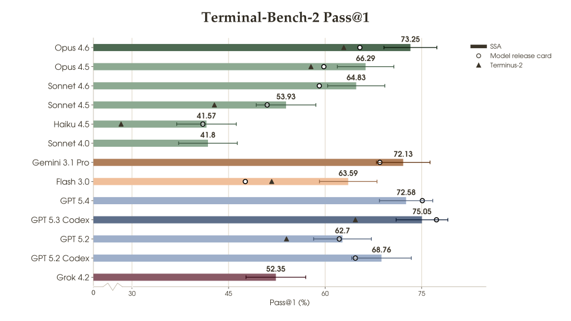

<div align="center">
  <div>
    <a href="https://strandsagents.com">
      
    </a>
  </div>
</div>

# Strands Benchmark Harnesses

A repository for Strands-based agents and harnesses for agentic benchmarks. It is a
[uv workspace](https://docs.astral.sh/uv/concepts/projects/workspaces/): the repository
root coordinates one or more member packages. Setup, configuration, and usage live in each agent's README.

## Agents

### Simple Strands Agent 

**A lean autonomous-coding agent achieving state-of-the-art performance across software engineering benchmarks.**

[](https://www.python.org/downloads/)
[](LICENSE)
[](https://www.docker.com/)

For a summary of the work, see the [post on Amazon-Science.](https://www.amazon.science/blog/bridging-intent-and-execution-in-agentic-systems)

---

### Overview

Simple Strands Agent (SSA) is a minimal, hackable harness for autonomous software engineering. It pairs frontier LLMs (Claude, GPT, Gemini, and open-weight models via Bedrock/LiteLLM/vLLM) with `bash` and file-editing tools inside isolated Docker environments to analyze codebases, diagnose bugs, write patches, and verify solutions.

The harness is built for **rapid experimentation** — swap models, tune prompts, adjust tool behavior, and benchmark all in a single config change. Despite its simplicity, SSA delivers SOTA-level results on widely-used coding benchmarks including **SWE-Bench Verified**, **SWE-Bench Pro**, and **Terminal Bench 2**.


### Highlights

- **Model-agnostic** — first-class adapters for Anthropic, OpenAI, Google, xAI, Bedrock, and any OpenAI-compatible endpoint (vLLM, LiteLLM, Together, Vertex, Z.AI).
- **Composable tools** — `bash`, `str_replace_editor`, `think`, and `submit` primitives with per-tool output clipping and timeout controls.
- **Isolated environments** — Docker-backed sandboxes with streaming exec, automatic image resolution, and ECR support.
- **Hydra-powered configs** — every knob is overridable from the command line; experiments are reproducible from a single YAML.
- **Built-in benchmarking** — turnkey scripts for SWE-Bench Verified, SWE-Bench Pro, and Terminal Bench 2, including S3 result upload.


### Installation

#### Requirements
- **Python** 3.12+
- **Docker** for containerized task environments
- **AWS credentials** if using Amazon Bedrock for model access and/or Amazon ECR for docker images
- **[uv](https://github.com/astral-sh/uv)** package manager (optional, but recommended)


```bash
git clone https://github.com/strands-labs/benchmark-harnesses.git
cd benchmark-harnesses

# Recommended: sync the workspace (creates .venv with this package + its deps)
uv sync
source .venv/bin/activate

# Or install just this package with pip
pip install -e .
```

### Quick Start

#### Run a single instance

```bash
uv run python -m ssa.run \
    --config-name=default.yaml \
    dataset.name=sbv \
    dataset.identifier=django__django-15987 \
    env.env_type=docker \
    env.docker.workdir="/testbed"
```

We provide simple scripts for running instances from [SWE-Bench Verified](/simple-strands-agent/scripts/swe_verified/run.sh), [SWE-Bench Pro](/simple-strands-agent/scripts/swe_pro/run.sh), and [Terminal-Bench-2](/simple-strands-agent/scripts/tb2/run.sh) (and see [this](/simple-strands-agent/scripts/tb2/run_harbor.sh) for running Terminal-Bench-2 with SSA's harbor plugin).

### Configuration

SSA uses [Hydra](https://hydra.cc/) for configuration. All configs live in [`src/ssa/configs/`](/simple-strands-agent/src/ssa/configs/), and any parameter can be overridden from the command line. Start from [`src/ssa/configs/default.yaml`](/simple-strands-agent/src/ssa/configs/default.yaml) for the full schema, then mix in a model-specific config as needed.


### Architecture
SSA's design and execution loop is summarized in the following figure:




### Results

**SWE-Bench Verified:**



**SWE-Bench Pro:**



**Terminal Bench 2:**




### Repository Layout
The code is structured as follows:
```
src/ssa/
├── agent.py / agent_runner.py     # Core agent loop
├── models/                        # Model adapters (Anthropic, OpenAI, Bedrock, ...)
├── tools/                         # bash, str_replace_editor, think, submit
├── environments/                  # Docker-backed sandbox
├── conversation_manager/          # Context management & truncation
├── hooks/ • callbacks/ • metrics/ # Observability and instrumentation
├── prompts/ • configs/            # System prompts and Hydra configs
└── run.py                         # Entry point
scripts/
├── swe_verified/ • swe_pro/ • tb2/
```

## Running agents safely

Agents in this repository are given access to shell tools. In practice, this means the model can run commands in the environment where the agent is started.

This is useful for experiments and benchmarking, but it also means you should treat the agent like you would treat any program with shell access: it may read files, modify files, delete data, install packages, or accidentally expose information from the environment.

For normal use, we recommend running agents in an isolated environment rather than directly on your machine. Our experiments and benchmarks are run inside Docker containers. You should avoid running agents in an environment that contains secrets, credentials, personal files, production data, or anything you would not want the model to access.

A good default setup is:

- run the agent inside Docker or another sandboxed environment
- mount only the files/directories the agent actually needs
- avoid exposing cloud credentials, SSH keys, API keys, or other secrets
- do not run it with unnecessary privileges
- inspect outputs before trusting or reusing them

Agents will usually behave as instructed, but shell access is powerful. Use the same caution you would use when running code from an automated system.

## License

[Apache 2.0](LICENSE)
