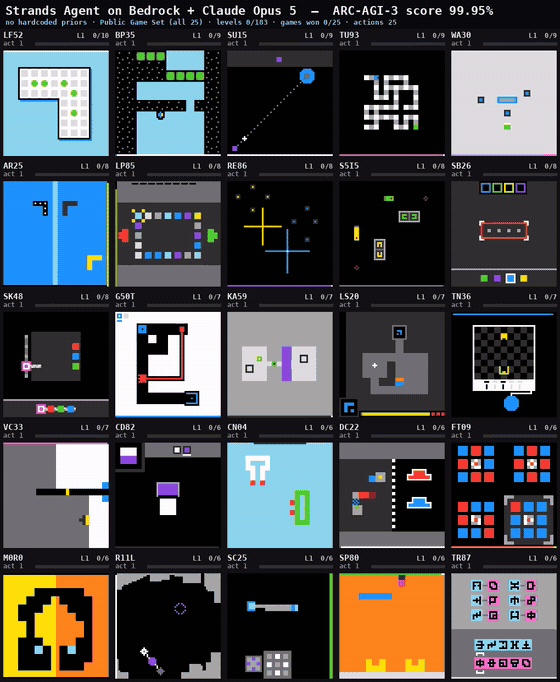

# ARC-AGI-3 Agent

[ARC-AGI-3](https://three.arcprize.org) is a set of interactive games that come with no
instructions. To win one, an agent has to work out what the controls do, what it is looking
at, and what counts as progress — by playing. The benchmark exists to measure learning from
experience: in ARC Prize's words, "as long as there is a gap between AI and human learning,
we do not have AGI".

This project is a coding agent, built on the
[Strands Agents SDK](https://strandsagents.com) and
[Amazon Bedrock](https://aws.amazon.com/bedrock/), that plays those games and wins them. It
starts each game with no idea what the buttons do or what it is looking at, and no statement
of the objective. It figures out the goal and the rules by writing and running its own code
against a log of everything it has done so far, forms hypotheses about the mechanics, tests
them, keeps the scripts that prove useful, and plays until it wins. Each turn builds on the
work of the last, rather than re-reading an ever-larger prompt.

This repo is based on **[PRO-LONG](https://github.com/alexisfox7/PRO-LONG)**, a minimal
memory layer that lets LLM agents work on long-horizon tasks. Our modifications are summarized
under [Our contribution](#our-contribution).



*All 25 games, one frame per action, rendered from the run's own logs. Each cell shows the
live board, current level, levels completed, and action count.*

## Result

Running Claude Opus 5 (High) on Amazon Bedrock, the agent completed
**183/183 levels across 25/25 environments for a score of 99.95%** on the public ARC-AGI-3
game set, in competition mode.

| | |
|---|---|
| score | **99.95%** |
| levels | 183 / 183 |
| environments | 25 / 25 |
| cost | ~$830 (est.) |
| scorecard | [`8a10b024-3560-448f-ac31-becc48affe5b`](https://arcprize.org/scorecards/8a10b024-3560-448f-ac31-becc48affe5b) |

## Our contribution

We made four changes on top of [PRO-LONG](https://github.com/alexisfox7/PRO-LONG), which provides the game loop and the append-only log. We removed the game priors from the system prompt, built the Strands +
Bedrock agent, put a sandbox around its tools, and added the recovery paths for reliability. We also provide [an analysis](#logtxt-access-pattern) on how the agent actually reads the log.

### 1. A generic system prompt

ARC-AGI-3 is designed to measure learning from experience, with no pre-loaded knowledge given
to the agent. The prompt should therefore cover only the interface — how to read the log, how
to write `actions.json` — and leave the games themselves to the agent:

- actions are listed by name alone (`ACTION1`, `ACTION2`, ...), with no meaning attached
- cell values are left unnamed: `HEX_COLOR_MAP` and `ASCII_COLOR_MAP` are empty
- no game structure is asserted — no players, walls, goals, timers or step budgets
- the opening line calls it an `unknown environment`, not a `grid-based puzzle game`

The agent works the rest out from its own log, which is what makes the same prompt serve
all 25 games. It is in [`prolong_agent/agent/prompts.py`](prolong_agent/agent/prompts.py).

### 2. The agent: Strands Agents on Amazon Bedrock

`agent/strands_agent.py` builds a `strands.Agent` per turn and calls it with the log path.

A single `agent(prompt)` call is not one model invocation — it is a full ReAct loop. Strands
runs the model, executes whatever tools it asks for, feeds the results back, and repeats
until the model stops requesting tools. In this workload a turn averages around ten model
calls: the agent greps its log, writes a parser, runs it, looks at the output, revises, and
eventually writes `actions.json`. Strands owns that loop, the tool dispatch and the message
state; this project supplies the model configuration and the tools.

### 3. A bubblewrap sandbox for the agent's tools

`agent/strands_tools.py` gives the agent six tools — `read_file`, `write_file`, `edit_file`,
`grep`, `glob_files`, `bash` — each executing inside
[bubblewrap](https://github.com/containers/bubblewrap):

```
--unshare-all                     no network, no IPC, isolated namespaces
--ro-bind /usr /bin /lib /lib64   read-only system
--tmpfs /tmp                      ephemeral
--die-with-parent                 no orphaned processes
--new-session                     no terminal hijack
```

Writes are confined to the game's own workspace. `bash` refuses network clients, package
managers, version control and cloud CLIs, and both its runtime and the size of its output are
capped. If `bwrap` is unavailable the tool declines to run rather than execute unsandboxed.

The agent has no network access, so it cannot look up the games or reach any service, and no
access to cloud credentials. Its only channel back to the runner is `actions.json`.

### 4. Reliability

- **Step-failure recovery** — three consecutive permanently-failing actions discard the
  stale plan and re-plan rather than ending the game on the first.
- **Route retry on a stalled stream** — when a streaming call stops producing bytes without
  closing, the lane retries on another Bedrock inference profile or region for the same
  model. A client-side mitigation; prefer platform-level resilience where possible.

## Setup

Requires Python 3.12+, [uv](https://docs.astral.sh/uv/), and `bubblewrap` for the sandbox.

This agent is a **standalone uv project** inside the `benchmark-harnesses` repository rather
than a member of the root [uv workspace](https://docs.astral.sh/uv/concepts/projects/workspaces/).
It pins `strands-agents==1.50.1`, which cannot co-resolve with `simple-strands-agent`'s
`==1.45.0` in the workspace's single shared lockfile, so it keeps its own `pyproject.toml` and
`uv.lock`. Sync from **this directory**, not the repository root:

```bash
git clone https://github.com/strands-labs/benchmark-harnesses.git
cd benchmark-harnesses/arc-agi-3-agent
uv sync --frozen
sudo apt-get install -y bubblewrap   # Debian/Ubuntu
```

`uv.lock` here is the exact dependency set used for the 99.95% run below, so `--frozen`
reproduces that environment; drop it if you would rather resolve fresh.

You need three things:

**1. An ARC API key** from [three.arcprize.org](https://three.arcprize.org), in a `.env`
file or the environment:

```
ARC_API_KEY=...
```

**2. AWS credentials** with `bedrock:InvokeModelWithResponseStream`, resolved the usual way
(instance role, `AWS_PROFILE`, or environment variables).

**3. Model access enabled** for the Bedrock model you intend to use, in the regions you
intend to use. The default route is `global.anthropic.claude-opus-5` in `us-west-2`.

## Usage

Run from this directory (`arc-agi-3-agent/`). One command plays all 25 games concurrently and
publishes a scorecard:

```bash
uv run prolong-swarm \
  -m global.anthropic.claude-opus-5 \
  --operation-mode competition \
  --effort high --grid-mode ascii --action-cap 20 \
  --max-actions 1000000
```

A single short game, to check the setup end to end for a few dollars:

```bash
uv run prolong-swarm -m global.anthropic.claude-opus-5 \
  --game ft09 --operation-mode online --effort high --grid-mode ascii
```

Results land in `evaluation_results/<timestamp>_.../<game>/`, one directory per game:
`logs.txt` (the log the agent reads), `checkpoint.json`, `usage.json` (token totals), plus
whatever scripts and notes the agent wrote for itself.

### Flags that matter

| Flag | Default | Notes |
|---|---|---|
| `--operation-mode` | `normal` | Use `competition` for a leaderboard-eligible scorecard |
| `-m`, `--model` | — | Any Bedrock model id or inference profile |
| `--effort` | `high` | Maps to `output_config.effort` on models that support it |
| `--grid-mode` | `hex` | Board rendering in the log; `ascii` was used for the run above |
| `--action-cap` | 20 | Max actions the agent may queue per turn |
| `--max-actions` | 500 | Per-game action ceiling; set high to let hard games run |
| `--game` | — | Comma-separated game ids, instead of all 25 |

**Cost and duration are material.** The 25-game run above took roughly 8 hours and cost
about $830 in Bedrock usage. Start with a single game.

## How it works

The loop comes from PRO-LONG and is unchanged here: the runner drains a queue of actions,
steps the environment, appends each resulting board to `logs.txt`, and when the queue empties
calls the agent with the *path* to that log. The agent writes `actions.json`; the runner
executes it; repeat.

The board is never pasted into the prompt. Everything the agent knows about a game, it
obtains by running code over a log file that reaches tens of megabytes — so context stays
small while history grows without bound, and the agent's own accumulated scripts become its
memory. That idea, and the evidence for it, are PRO-LONG's; see
[their paper](https://arxiv.org/abs/2607.20064).

## Log.txt access pattern

Because the board reaches the agent from a file, the agent ends
up doing its own context engineering: every turn it decides which slice of a multi-megabyte log
is worth loading, writes a program to extract that slice, and reasons over it.

For example, In the [99.95% run](https://arcprize.org/scorecards/8a10b024-3560-448f-ac31-becc48affe5b) the Strands agent created 734 scripts, of which 260 open `logs.txt`. We
classified those 260 into six access patterns. A script commonly matches several — one will
locate a marker and then extract the board after it — so the counts below add up to more than 260.

| Pattern | What the script does | # of script files | Games |
|---|---|---|---|
| `orient` | Measure the file, or look at the head of it | 133 | 23 / 25 |
| `locate` | Find the line numbers of the action headers | 214 | 24 / 25 |
| `extract` | Slice the lines after a marker and rebuild one 64×64 board | 127 | 21 / 25 |
| `compare` | Diff two boards to see what a single action changed | 14 | 10 / 25 |
| `aggregate` | Walk the whole history and tally something | 158 | 24 / 25 |
| `recency` | Take only the newest board and ignore the rest | 102 | 22 / 25 |

Three things follow that are worth knowing before building anything similar.

**`locate` dominates, so the log needs line numbers, not search.** Four out of five
log-reading scripts hunt for action headers. Every one of those hunts is a linear scan of a
file that grows to tens of megabytes, because nothing in the format is indexed. An index
keyed by action number would remove the most common operation in the workload.

**Most reads want the present, not the past.** `recency` appears in 39% of scripts, and it is
the cheapest possible query — the last 64 lines. The deep history is a minority of the
traffic, though it is the valuable minority: replaying an earlier action to check a rule is
what `compare` and `aggregate` exist for.

**`comparing`** appears only in 5%
of scripts and 10 of 25 games. It appears that the agent spends more effort reading the current board
than checking whether the board it predicted matches the board the environment returned.

## Repository layout

```
prolong_agent/
  agent/
    strands_agent.py      this project: the Strands + Bedrock agent
    strands_tools.py      this project: six sandboxed tools
    swarm.py              PRO-LONG: 25-lane orchestrator + CLI  (modified)
    base.py               PRO-LONG: analyzer contract, actions.json parsing
    prompts.py            PRO-LONG: system prompt               (modified to remove priors)
    action_queue.py       PRO-LONG
    game_state.py         PRO-LONG: board rendering, hint blocks
  environment/
    runner.py             PRO-LONG: the game loop               (modified)
    arcagi3.py            PRO-LONG: ARC API wrapper
  metrics/, utils/        PRO-LONG: reporting, structures, parsing helpers
```

## Acknowledgement

Thanks to the PRO-LONG team for open-sourcing their framework.

## References

- Strands Agents SDK: https://strandsagents.com
- Amazon Bedrock: https://aws.amazon.com/bedrock/
- ARC-AGI-3: https://arcprize.org/arc-agi/3
- PRO-LONG: https://github.com/alexisfox7/PRO-LONG · paper
  [arxiv.org/abs/2607.20064](https://arxiv.org/abs/2607.20064)
